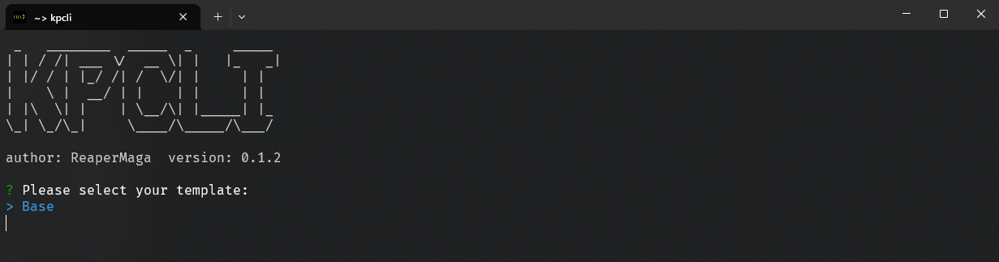
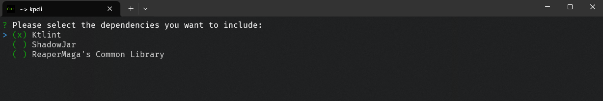

## KPCLI

It's a simple cli wizard tool that helps you to create a kotlin gradle project

### Installation

#### Prerequisites
- Java 21

Download the last `kpcli.bat` or `kpcli` binary from [releases](https://github.com/ReaperMaga/kpcli/releases) and those to your path. These files should be located under the same folder.

### Usage

Just execute `kpcli` in a terminal and the tool will ask you some questions.

### Screenshots

 
 
